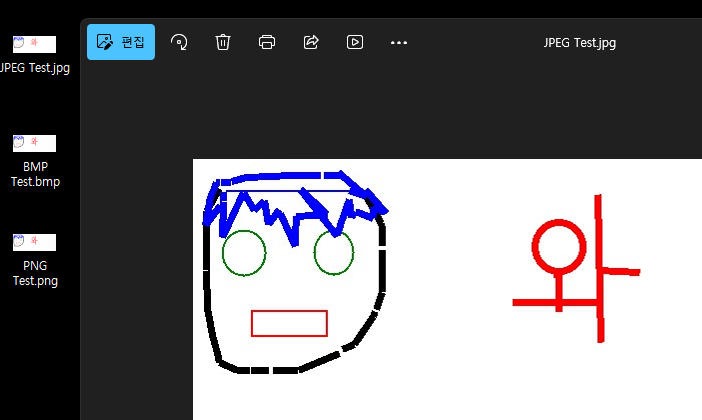
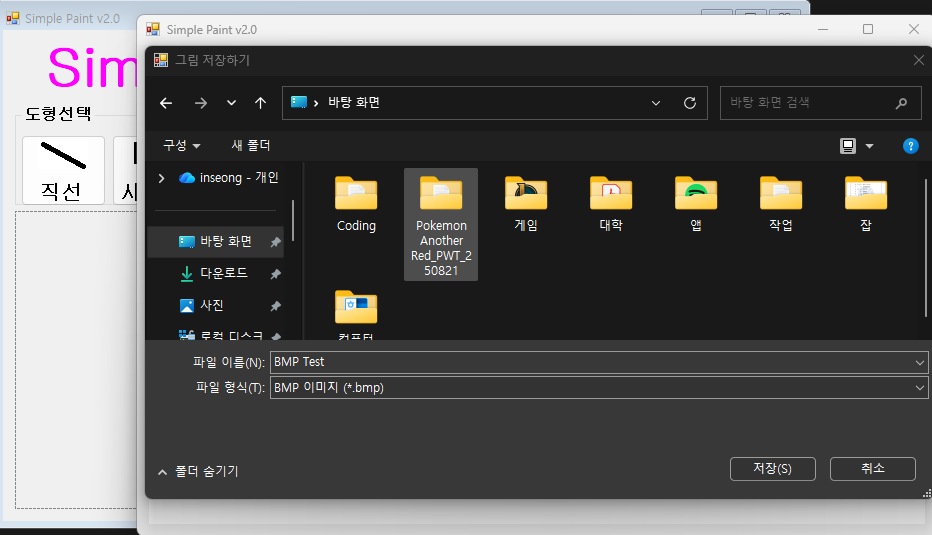
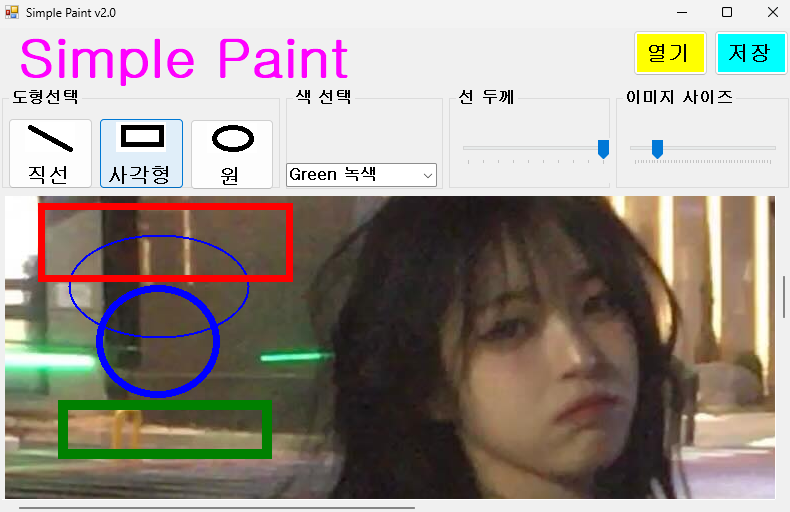

# (C# 코딩) 그림판
## 개요

-C# 프로그래밍학습

-1줄소개: 이미지 파일을 다루고 도형을 그릴 수 있는 그림판 툴

-사용한플랫폼: 
    -C#, .NET Windows Forms, Visual Studio, GitHub

-사용한컨트롤:- Bitmap, Graphics, Pen§PictureBox, ComboBox, TrackBar§PictureBox.Image, ComboBox.SelectedIndex, TrackBar.Value§OpenFileDialog, SaveFileDialog

-사용한기술과구현한기능:
    - 캔버스 실시간 드래그 처리
    - Bitmap 기반 캔버스에 마우스 이벤트 기반의 도형 그리기.
    - 캔버스에서 이미지 파일 사용 가능하게끔 구현.
    - 불러온 이미지에 그림을 그리고 그 결과를 이미지 파일로 저장하는 기능 구현

## 실행화면
-코드의실행스크린샷과구현내용설명

-구현한내용(위그림참조)
    - GUI를 설계하고, 컨트롤의 이름을 수정하여 배치하였습니다.
    - 컨트롤의 기본 기능 구현을 확인하고, 도형선택, 색상선택, 선굵기선택 기능을 구현하였습니다.
    -각 컨트롤의 값 변경을 SelectedIndexChanged, ValueChanged를 연동하여 선택된 데이터가 실시간으로 캔버스 설정 변수에 반영되도록 했습니다.
    

## 실행화면
-코드의실행스크린샷과구현내용설명

-구현한내용(위그림참조)
    - 마우스를 이용한 도형 그리기 기능을 구현했습니다.
    - 도형 그리기 기능에 색 4가지와 선 두께 조절 기능을 추가하였고, 구현과 확인 완료하였습니다.
    - 마우스 이벤트(MouseDown, MouseMove, MouseUp)를 조합하여 드래그 앤 드롭 조작 방식을 구현했습니다.
    - Paint 이벤트와 Invalidate() 메서드를 활용해 드래그 중인 도형의 미리보기가 캔버스에 실시간으로 렌더링 되도록 처리했습니다.

## 실행화면
-코드의실행스크린샷과구현내용설명

-구현한내용(위그림참조)
    - 그린 도형 그림을 저장 버튼을 통해 이미지 파일로 저장하는 기능 구현했습니다.
    - 파일저장을 위해 SaveFileDialog을 사용했습니다.
    - 3가지 포맷으로 저장할 수 있는 기능을 구현했습니다. (png,jpg,bmp)
    - Filter 속성으로 지정된 확장자만 선택하도록 하고, ImageFormat 객체를 활용해 선택한 포맷에 맞춰 비트맵 데이터를 저장하게끔 하였습니다.

## 실행화면
-코드의실행스크린샷과구현내용설명

-구현한내용(위그림참조)
    - OpenFileDialog를 사용하여 PC에 저장된 외부 이미지 파일을 캔버스로 불러오는 기능을 구현했습니다.
    - 원본 이미지를 Bitmap으로 복사하여 띄우고, 그 위에 기존처럼 도형을 덧그릴 수 있도록 연동했습니다.
    - Panel의 AutoScroll 속성을 활용해, 불러온 이미지가 화면 창보다 클 경우 상하좌우 스크롤바가 자동으로 생성되도록 처리했습니다.
    - TrackBar 컨트롤을 추가하여, 사용자가 슬라이더를 움직여 캔버스의 크기를 직관적으로 확대 및 축소(10% ~ 500%)할 수 있는 줌(Zoom) 기능을 구현했습니다.