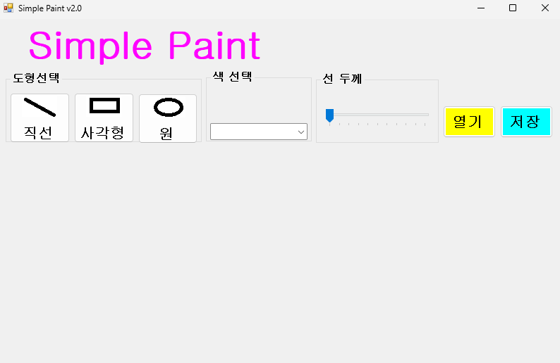
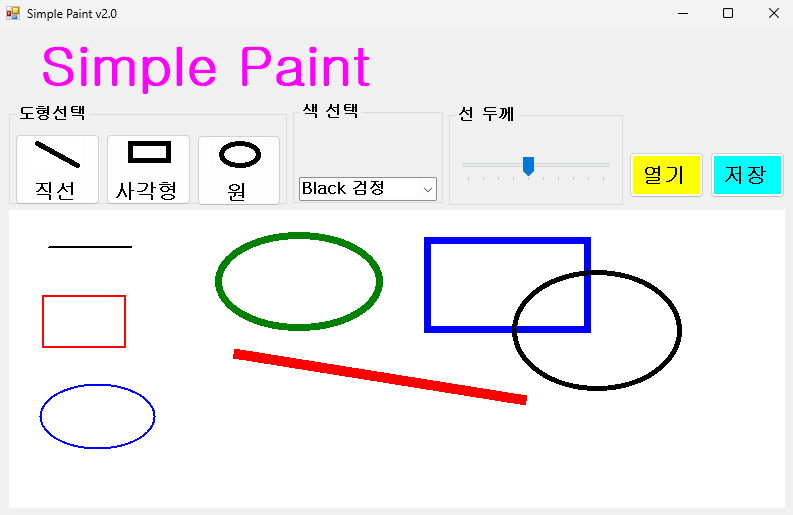

# (C# 코딩) 그림판
## 개요

-C# 프로그래밍학습

-1줄소개: 이미지 파일을 다루고 도형을 그릴 수 있는 그림판 툴

-사용한플랫폼: 
    -C#, .NET Windows Forms, Visual Studio, GitHub

-사용한컨트롤:- Bitmap, Graphics, Pen§PictureBox, ComboBox, TrackBar§PictureBox.Image, ComboBox.SelectedIndex, TrackBar.Value§OpenFileDialog, SaveFileDialog

-사용한기술과구현한기능:
    - 캔버스 실시간 드래그 처리
    - Bitmap 기반 캔버스에 마우스 이벤트 기반의 도형 그리기.
    - 캔버스에서 이미지 파일 사용 가능하게끔 구현.
    - 불러온 이미지에 그림을 그리고 그 결과를 이미지 파일로 저장하는 기능 구현

## 실행화면
-코드의실행스크린샷과구현내용설명

-구현한내용(위그림참조)
    - GUI를 설계하고, 컨트롤의 이름을 수정하여 배치하였습니다.
    - 컨트롤의 기본 기능 구현을 확인하고, 도형선택, 색상선택, 선굵기선택 기능을 구현하였습니다.
    

## 실행화면
-코드의실행스크린샷과구현내용설명

-구현한내용(위그림참조)
    - 마우스를 이용한 도형 그리기 기능을 구현했습니다.
    - 도형 그리기 기능에 색 4가지와 선 두께 조절 기능을 추가하였고, 구현과 확인 완료하였습니다.

## 실행화면
-코드의실행스크린샷과구현내용설명

-구현한내용(위그림참조)
    - 
    - 

## 실행화면
-코드의실행스크린샷과구현내용설명

-구현한내용(위그림참조)
    - 
    - 